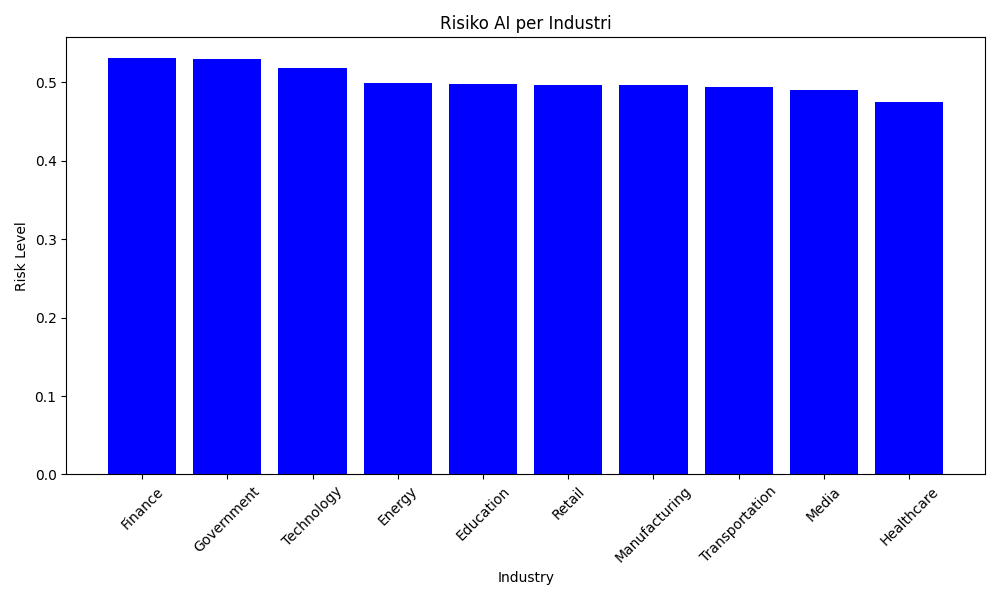

# AI-Job-Market-Impact-Analyzer-2030
Aplikasi CLI berbasis Python untuk menganalisis dan memvisualisasikan risiko dampak AI terhadap berbagai sektor pekerjaan tahun 2030 menggunakan Pandas &amp; Matplotlib

# 🤖 AI Job Market Impact Analyzer 2030

Aplikasi berbasis CLI (Command Line Interface) yang dibangun menggunakan Python untuk menganalisis dampak risiko kecerdasan buatan (AI) terhadap berbagai sektor pekerjaan di tahun 2030. Proyek ini menggunakan dataset publik dari Kaggle.

## 🚀 Fitur Utama
- **Ringkasan Dataset:** Menampilkan struktur awal data secara ringkas.
- **Analisis Risiko Industri:** Mengelompokkan dan mengurutkan industri dengan rata-rata risiko tertinggi terkena dampak AI.
- **Pencari Profesi Aman:** Melakukan advanced filtering untuk mencari profesi yang minim risiko AI namun tren rekrutmennya terus berkembang.
- **Export Dashboard:** Mengolah data secara visual menjadi grafik batang dan mengekspornya otomatis menjadi file gambar (.png).

## 🛠️ Teknologi yang Digunakan
- **Python 3.11**
- **Pandas** (Data Wrangling & Agregasi)
- **Matplotlib** (Visualisasi Data)
- **Pathlib** (Manajemen Jalur File Dinamis)

## 📊 Hasil Visualisasi Dashboard
Berikut adalah contoh grafik yang dihasilkan otomatis oleh sistem dan disimpan ke dalam folder `mainImg/`:

## 📅 Sumber Dataset
Dataset yang digunakan dalam proyek ini diambil dari platform **Kaggle**:
- **Nama Dataset:** AI Impact on Jobs (2030)
- **Sumber Link:** https://www.kaggle.com/datasets/muhammadwaqas023/ai-impact-in-future-on-jobs-market-in-2030
- **Deskripsi Singkat:** Dataset ini berisi 3.000 baris data proyeksi mengenai tingkat risiko pergantian profesi oleh AI, tren rekrutmen, serta estimasi pertumbuhan gaji di berbagai sektor industri menjelang tahun 2030.
